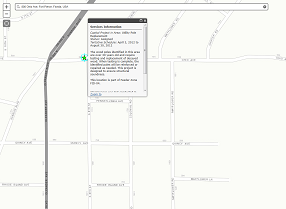

# service-lookup

Web app template that is used to determine if the location specified intersects a polygon.  The location entered is optionally stored in a layer in the web map.

## Features
* Place Finding - Find places or geocode an address
* Graphics - Draw a point
* Query - Determine if drawn graphic is within a specific area
* Webmap- Use the template with ArcGIS Online webmaps 

## Instructions

1. Fork and then clone the repo. 
2. Update the configuration settings to use template
2. Run and try the samples.

## Requirements

* Notepad or your favorite HTML editor
* Web browser with access to the Internet

## Resources

* [ArcGIS for JavaScript API Resource Center](http://help.arcgis.com/en/webapi/javascript/arcgis/index.html)
* [ArcGIS Blog](http://blogs.esri.com/esri/arcgis/)
* [twitter@esri](http://twitter.com/esri)

## Issues

Find a bug or want to request a new feature?  Please let us know by submitting an issue.

## Contributing

Esri welcomes contributions from anyone and everyone. Please see our [guidelines for contributing](https://github.com/esri/contributing).

## Licensing
Copyright 2013 Esri

Licensed under the Apache License, Version 2.0 (the "License");
you may not use this file except in compliance with the License.
You may obtain a copy of the License at

   http://www.apache.org/licenses/LICENSE-2.0

Unless required by applicable law or agreed to in writing, software
distributed under the License is distributed on an "AS IS" BASIS,
WITHOUT WARRANTIES OR CONDITIONS OF ANY KIND, either express or implied.
See the License for the specific language governing permissions and
limitations under the License.

A copy of the license is available in the repository's [license.txt](https://github.com/esri/service-lookup/blob/master/License.txt) file.

​
